# Estate360 — System Design

**Last updated:** 2026-09-13
**Scope:** Whole-project architecture, data model, request lifecycle, user flows, and deployment.
**Stack:** Next.js 16 (App Router, RSC) · TypeScript · Prisma 7 · PostgreSQL (Supabase, `pgvector`) · NextAuth v5 · Supabase Storage · Redis (Upstash) · Stripe · Twilio / WhatsApp / Unipile · Tailwind v4 + shadcn/ui · Vercel (Fluid Compute).

Estate360 is a **shared-schema multi-tenant real-estate CRM** for builders, brokers, and sales teams. One Postgres database, one set of tables; every tenant-owned row is tagged with `workspaceId`, and every query is scoped to it. There is no per-tenant schema or database.

---

## 1. System context

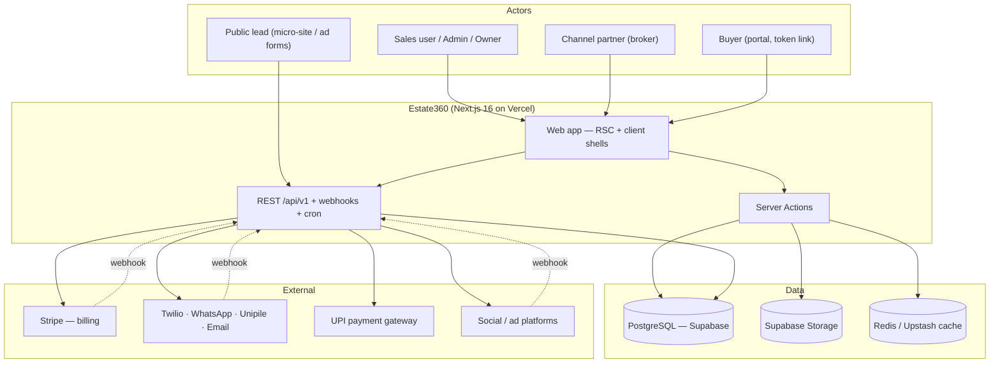

---

## 2. Container / layer architecture

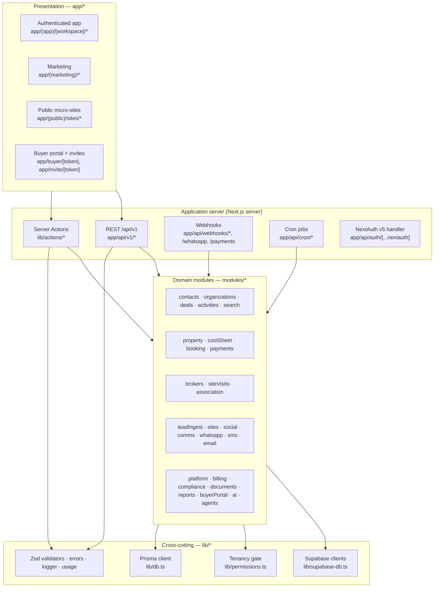

**Two write/read surfaces:**

- **Server Actions** (`lib/actions/*`, plus per-module functions) — primary path for the first-party web app, called directly from RSC/client components under `app/(app)/[workspace]/*`.
- **REST `/api/v1` + webhooks** — programmatic surface for external systems (lead intake, payment/social/Stripe callbacks, public micro-site enquiries), authenticated by workspace API key or provider signature rather than session.

**DB access** flows through a single Prisma client (`lib/db.ts`) built on `@prisma/adapter-pg`, with a `globalForPrisma` singleton to survive HMR. Under Vitest, a dummy adapter is injected so pure-function modules import without a live DB.

---

## 3. Tech-stack rationale — why Supabase

Supabase provides the **database, storage, and Postgres primitives** in one managed platform. Application **auth is NextAuth v5**, with the Supabase Postgres instance as the user/session store — the two compose cleanly.

### 3.1 Why Supabase for the database

| Need | Supabase delivers | Why not the alternative |
|---|---|---|
| **Managed Postgres, standard wire protocol** | Real Postgres — Prisma connects via `@prisma/adapter-pg` with a plain connection string. Zero lock-in; the same code runs on Neon or self-hosted Postgres by swapping `DATABASE_URL`. | **PlanetScale (MySQL)** drops foreign keys and lacks Postgres features the schema relies on. **Firebase/Firestore** is a document store — no relational joins, no SQL, poor fit for a normalized CRM with deep relations (deal → unit → cost sheet → payment plan). |
| **Vector search in the same DB** | `pgvector` extension + HNSW indexing live inside the primary Postgres, so semantic features need no separate vector store. | A dedicated vector DB (Pinecone/Weaviate) adds a second system to operate, sync, and pay for. |
| **Row-Level Security backstop** | Native Postgres RLS gives a defense-in-depth tenant guard beneath the app-layer `workspaceId` filter. | App-only isolation has no database-side safety net. |
| **Connection pooling at scale** | Built-in Supavisor/PgBouncer pooler — essential for serverless/Fluid Compute where connections churn. | Raw Postgres exhausts connections under serverless fan-out. |
| **Storage + SQL from one vendor** | Object storage (documents, generated PDFs, media) with the same auth model and dashboard. | Stitching S3 + a separate DB host means two IAM models and two bills. |

**Neon** is the closest peer and remains a drop-in fallback (README notes both) — Supabase is preferred because it bundles Storage, `pgvector`, RLS, and the pooler in one console, reducing operational surface for a small team.

### 3.2 Why NextAuth (not Supabase Auth) for authentication

- **Session model owned in-app.** NextAuth v5 uses a **JWT strategy** (30-day maxAge). The token carries `id`, `workspaces[]` (id/slug/name/role), and `activeWorkspaceId`, hydrated from the DB in the `jwt` callback (`lib/auth.ts`). Workspace switching is a client-side `useSession().update`, not a round-trip to an external auth service.
- **Provider flexibility.** Credentials (bcrypt) is always on; Google is dormant until `GOOGLE_CLIENT_ID/SECRET` are set. Adding providers is a config change.
- **Tenancy lives in our tables.** Membership and role (`WorkspaceMember`) are first-class relational rows the CRM already joins against — keeping identity in the same Postgres avoids syncing an external auth directory back into the domain model.
- **Supabase still contributes** cookie-aware server clients (`@supabase/ssr`, `lib/supabase-db.ts`) for storage access and the RLS JWT context.

---

## 4. Multi-tenancy & authorization

Isolation is enforced in **three layers** (defense-in-depth):

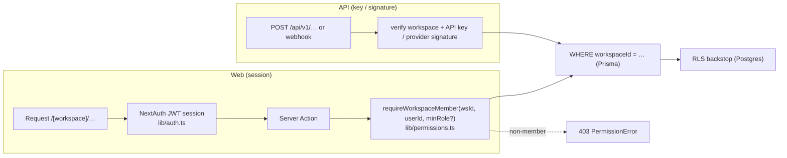

1. **App gate** — `requireWorkspaceMember(workspaceId, userId, minRole?)` runs before any data access; throws `PermissionError` → 403 on non-membership or insufficient role.
2. **Query scoping** — every Prisma `where` carries `workspaceId`.
3. **RLS backstop** — Postgres row-level security keyed off the tenant id resolved from the JWT/GUC.

**Roles & capabilities** (`lib/permissions.ts`):

- Rank: `VIEWER / BROKER / MEMBER / SALES = 0 < ADMIN = 1 < OWNER = 2`.
- Capability helpers: `canInvite`, `canManageData`, `canManageBilling`, `canManageInventory`, `isOwner` (ADMIN+OWNER for most; OWNER-only for workspace deletion).
- **Row-level broker scope:** `brokerScopeFilter(role, brokerId)` narrows `BROKER` users to their own `brokerId`; an unlinked broker gets an unmatchable filter (`__no_broker__`). Orthogonal to role rank.

---

## 5. Data model

Grouped by concern; every tenant table carries `workspaceId`.

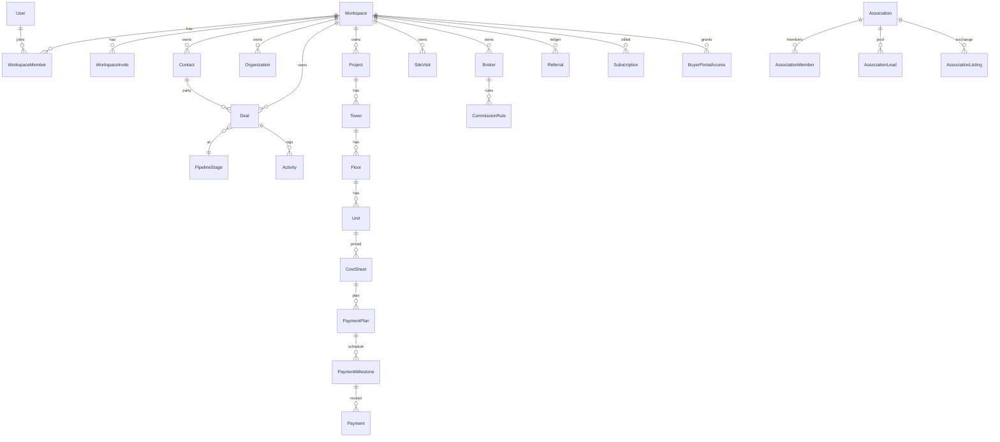

| Group | Models |
|---|---|
| Tenancy | `Workspace`, `User`, `WorkspaceMember`, `WorkspaceInvite` |
| CRM core | `Contact`, `Organization`, `PipelineStage`, `Deal`, `Activity`, `Tag`, `ContactTag`, `DealTag` |
| Inventory + transactions | `Project`, `Tower`, `Floor`, `Unit`, `CostSheet`, `PaymentPlan`, `PaymentMilestone`, `Payment` |
| Brokers / visits | `SiteVisit`, `Broker`, `CommissionRule` |
| Association (NAAR pool) | `Association`, `AssociationMember`, `AssociationLead`, `AssociationListing`, `Referral` |
| Billing / usage | `Subscription`, `PlanLimits`, `UsageEvent`, `UsageCounter` |
| Documents | `DocumentTemplate`, `GeneratedDocument` |
| Integrations | `SocialConnection`, `SocialEvent`, `WebhookEvent` |
| Buyer portal | `BuyerPortalAccess` |

Key enums: `Role`, `ActivityType`, `UnitStatus`, `UnitConfig`, `DocumentKind`.

---

## 6. Module inventory

Domain modules under `modules/*`. Tenancy guard is `workspaceId` unless noted.

| Module | Responsibility | Guard |
|---|---|---|
| contacts | Contact CRUD + import | `workspaceId` |
| organizations | Company records + email-domain auto-link | `workspaceId` |
| deals | Pipeline, kanban, stage transitions | `workspaceId` |
| search | Cross-entity full-text search (tsvector) | `workspaceId` |
| property | Project / tower / floor / unit inventory | `workspaceId` |
| costSheet | Cost sheet + payment-plan engine | `workspaceId` |
| booking | Booking chain, CLP materialization | `workspaceId` |
| payments | UPI intake + payment reconciliation | `workspaceId` |
| brokers | Channel partners, commission rules | `workspaceId` + `brokerScopeFilter` |
| siteVisits | GPS-verified site visits | `workspaceId` |
| association | NAAR network: directory, pooled leads, listing exchange, referral ledger | `associationId` / `workspaceId` |
| leadIngest | Webhook lead ingestion + replay | `workspaceId` (source-keyed) |
| sites | Public micro-sites + enquiry capture | `workspaceId` |
| social | Social connections + token refresh | `workspaceId` |
| comms / whatsapp / sms / email | Unified messaging adapters | `workspaceId` |
| documents | Template → generated documents | `workspaceId` |
| reports | Funnel / inventory / collections / ROI, CSV+PDF export | `workspaceId` |
| billing | Stripe subscription + plan limits | `workspaceId` |
| compliance | DPDP / consent | `workspaceId` |
| buyerPortal | Token-scoped buyer access | `BuyerPortalAccess.token` |
| platform | API keys, platform internals | `workspaceId` |
| ai / agents | Assistive drafting, next-best-action, agentic orchestration | via caller |
| web-contact | Marketing contact-form intake | public |

---

## 7. Request lifecycle sequences

### 7.1 Server Action (web)

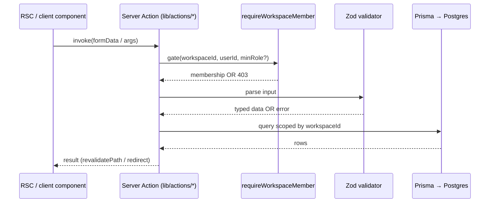

### 7.2 Inbound webhook (lead / payment / Stripe / social)

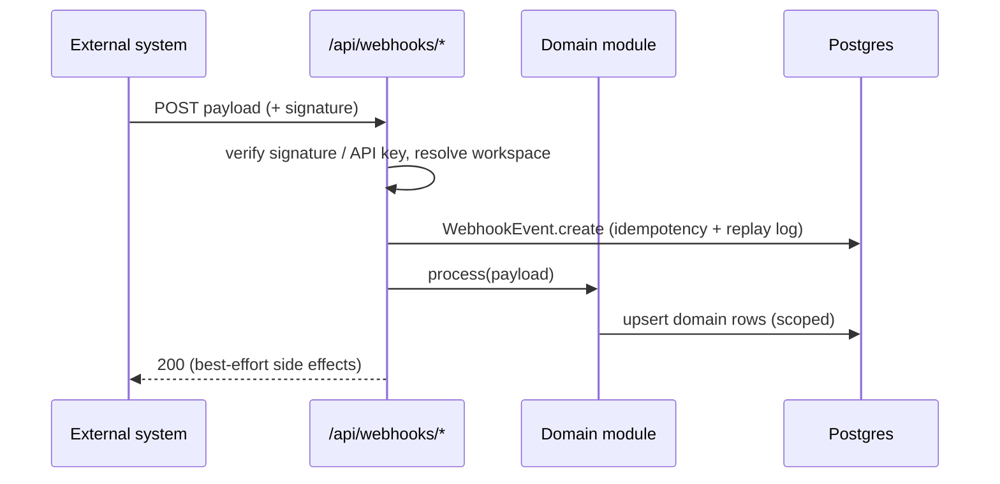

---

## 8. User flows

### 8.1 Onboarding

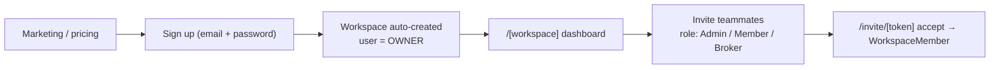

### 8.2 Lead → Deal → Booking → Payment (core revenue flow)

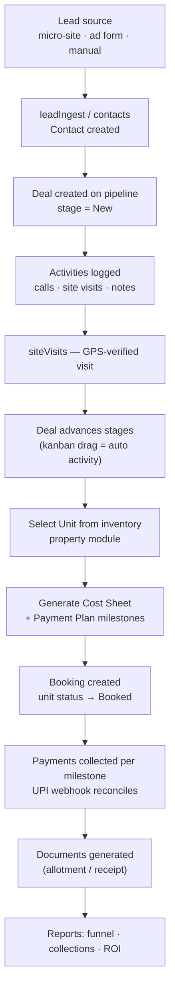

### 8.3 Buyer portal (external, token-scoped)

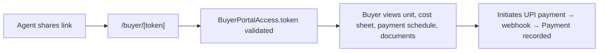

### 8.4 Broker / channel-partner flow

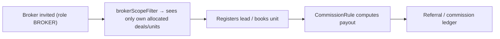

---

## 9. Integrations, webhooks & scheduled work

| Surface | Route | Purpose |
|---|---|---|
| Auth | `app/api/auth/[...nextauth]` | NextAuth handler |
| Billing | `app/api/billing/checkout`, `/portal`, `app/api/webhooks/stripe` | Stripe checkout, customer portal, subscription sync |
| Payments | `app/api/payments/upi/webhook` | UPI settlement reconciliation |
| Leads | `app/api/webhooks/leads/[source]`, `app/api/admin/leads/replay` | Multi-source lead intake + replay |
| Social | `app/api/webhooks/social/[provider]`, `app/api/admin/social/replay` | Social/ad events + replay |
| WhatsApp | `app/api/whatsapp/webhook` | Inbound WhatsApp messaging |
| Micro-sites | `app/api/sites/enquiry` | Public enquiry capture |
| Compliance | `app/api/compliance/dpdp` | DPDP consent / data requests |
| Cron | `app/api/cron/refresh-social-tokens` | Scheduled social token refresh |
| Public API | `app/api/v1/contacts` | Programmatic contact access (API key) |

`WebhookEvent` rows give idempotency and replay for external callbacks.

---

## 10. Deployment & scaling

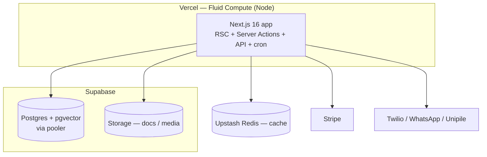

- **Compute:** Vercel Fluid Compute (full Node.js in functions and middleware; 300s default timeout).
- **DB:** Supabase Postgres behind the pooler; Prisma via `@prisma/adapter-pg`. Portable to Neon by changing `DATABASE_URL` only.
- **Cache:** Redis / Upstash.
- **Migrations:** `prisma migrate deploy` against production once per release; seed via `prisma db seed`.

---

## 11. Directory map

```
app/
  (auth)/            login + signup
  (app)/[workspace]/ dashboard, contacts, deals, organizations, projects,
                     bookings, site-visits, channel-partners, association,
                     documents, reports, inbox, ai, search, settings, tasks
  (marketing)/       product, pricing, contact, privacy, terms
  (public)/sites/    public project micro-sites
  buyer/[token]/     buyer portal
  invite/[token]/    invite acceptance
  api/               auth, v1, webhooks, billing, payments, sites, cron, compliance
modules/             domain modules (contacts, deals, property, booking, payments, …)
lib/                 db, auth, permissions, supabase clients, validators, usage
components/          shadcn/ui primitives + feature components
prisma/              schema, migrations, seed
docs/architecture/   this document
```
